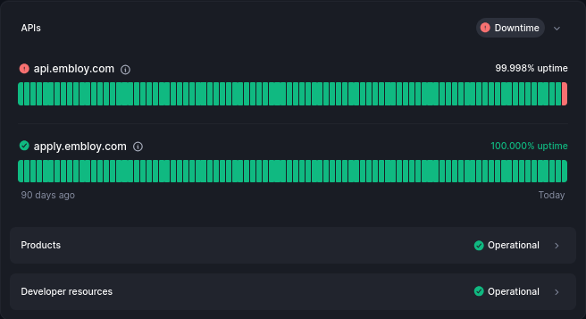

Hello Everyone,

As of today, we have officially shut down the Embloy Core API. We want to thank all who used and contributed to Embloy for your support and engagement over the past one and a half years.

Finally, we want to share some stats from the past two years:

- Over **10,000** candidates processed
- **50+** companies onboarded
- **2** major integrations launched
- More than **3.5 million** API requests handled
- **100%** uptime for main services
- **99.850%** uptime for integrations and developer tools

<!--truncate-->

If you need access to archived data or want to get in touch, here’s how to reach the team going forward:

- If you need to access archived data, please email us at [support@embloy.com](mailto:support@embloy.com).

- For any other inquiries, you can reach us at [info@embloy.com](mailto:info@embloy.com).

We will continue to monitor these email addresses for the foreseeable future, so please don’t hesitate to reach out if you need assistance.

Best,

The Embloy Team
