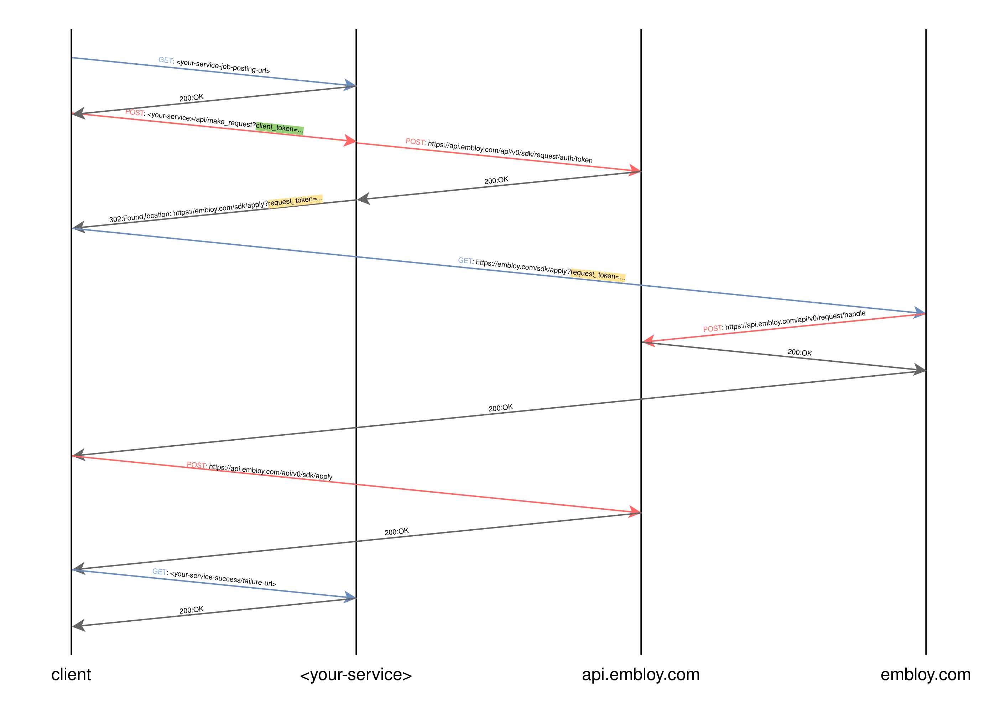

# Understanding Quicklink's internal functionality

This section provides a deep dive into the inner workings of Quicklink, giving you a better understanding of its internal mechanisms and processes.

## How does Quicklink work under the hood?

The diagram below illustrates the activity flow within Quicklink, providing a visual representation of its internal operations.

:::info
Our SDKs automatically handle requests from _\<your-service\>_ to _api.embloy.com_. Your role is simply to initiate a call to our SDK (the initial POST request) and then redirect the user to the URL provided in the response from our SDK (the subsequent GET request). From this point forward, the user is redirected to _embloy.com_, which manages all further requests.
::: 

You can find a more detailed BPMN2.0 diagram [here](/files/Quicklink.pdf).