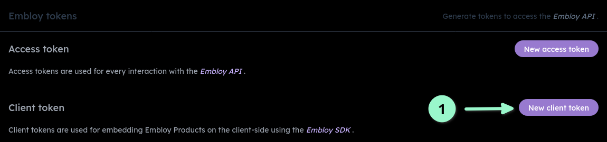
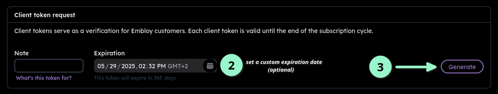

# Getting started - Enterprise

:::info
This guide is for medium and large companies that want to get started with Embloy. If you are a small or local business, please refer to the [Small Business guide](/docs/guides/get-started-small-business) or contact us directly.
<br/>**For those using an ATS with an existing Embloy integration, please consult [this guide](/docs/guides/get-started-integrations).**
<br/>**If your ATS provider is not yet supported, this guide will also cover how to set up custom webhooks.**
:::

Hey there! 👋 Welcome to Embloy! We are excited to have you on board. This guide will explain every step you need to take to integrate Embloy on your job page and make the most out of our platform.

## Step 1: Create an account

If you haven't already, you can create an Embloy account by visiting our [registration page](https://embloy.com/register). You can also sign up using your Google, LinkedIn, Microsoft, or GitHub accounts.

After you have created an account, you will receive a confirmation email. Click on the link in the email to verify your account.

_[More information](/docs/category/account)_

## Step 2: Subscribe to Embloy

[Choose a plan and subscribe](https://genius.embloy.com/settings?tab=billing) to Embloy. We partner up with Stripe to process payments, so you don't have to worry about us storing or processing any sensitive information.

_[More information](/docs/category/subscriptions)_

## Step 3: Create a client token 

Next, create a new `client_token` in the "secrets" tab of your [Embloy Genius settings](https://genius.embloy.com/settings?tab=secrets) and save it in your backend's environment file. 
  :::note
  The `client_token` defaults to a three-month expiration but can be extended up to one year. Post-expiration, a new token must be created and uploaded.
  :::



_[More information](/docs/core/tokens/token_info#client-token)_


## Step 4: Integrate Embloy into your page

### Server-side

Use the client token to request a redirection URL from the Embloy API for applicants. This requires adding an endpoint to your backend, which can be done manually or via Embloy's [SDKs](/docs/sdks/overview).

The process involves two steps:

1.  The "Apply with Embloy" button on your frontend triggers a call to your new endpoint, passing the job's posting ID.

    > e.g., `<your-api>/<your-endpoint>?postingID=<your-posting-ID>`

2.  Your endpoint uses the client token and job posting ID to either call our [SDKs](/docs/sdks/overview) or [this endpoint](https://docs.embloy.com/#7629b41f-882f-4897-bacd-5b900378eac6), returning a redirect link for the user.

    > If you use Rails, it could look like this:
    >
    >       ```ruby
    >       client_token = ... # Retrieve client token for the employer/owner of this job posting
    >       posting_id = params["postingID"] # The job's posting ID  needs to be passed to this endpoint
    >
    >       # Call our SDK (or manually the api.embloy.com/api/v0/sdk/request/auth/token endpoint)
    >       session = {mode: "your-ats-name", job_slug: posting_id}
    >       client = Embloy::Client.new(client_token, session)
    >       redirect_url = client.make_request
    >
    >       redirect_to redirect_url # Return the URL to which the user needs to be redirected
    >       ```
    >
    > :::tip
    > Consult our [SDK documentation](/docs/sdks/overview.mdx) for more examples and details.
    > :::

### Client-side: The "Apply with Embloy" button

Display the Embloy button on every job posting. When clicked, it should call the endpoint defined in Step 2.

A typical implementation might look like this, but for this part, you can think of an approach that works best for you:

```TSX title="application-form.tsx"
const handleApplyClick = async () => {
  try {
    // Call your endpoint as defined in step 2
    const response = await fetch('<your-api>/<your-endpoint>?postingID=<your-posting-ID>', {
      method: 'POST',
      headers: { 'Content-Type': 'application/json' },
    });

    // Redirect the user to the application portal
    window.location.href = (await response.json()).url;
  } catch (error) {
    console.error('Error:', error);
  }
};
```

<div style={{ display: 'flex', alignItems: 'center', justifyContent: 'space-between' }}>
  <p>The final step is to add the button to your UI that calls this action and looks like this one 👉</p>
  <a></a>
</div>

```TSX title="app/application-form.tsx"
<button onClick={handleApplyClick}> <!-- Style this accordingly so that it fits within your UI -->
  
</button>
```

When a candidate clicks on "_Embloy Apply_ " on your page, they will be then redirected to Embloy's application portal.

### _Optional:_ Custom webhooks for unsupported ATS providers

:::note
This section is only relevant, if you plan to synchronize incoming Embloy applications with other systems. 
:::

If your ATS provider is not yet supported, you can set up custom webhooks to integrate with Embloy, so that whenever a new Embloy application is received, we automatically forward it to your ATS.

1. Register a new webhook in Embloy.
2. Ensure the webhook payload includes essential details such as job ID, title, description, and any other pertinent information.
3. Embloy will then automatically forward applications received for these jobs to the endpoint specified in the webhook configuration.

## Conclusion

- With Embloy integrated, applications submitted through Embloy will be directly visible in the [recruiter portal](https://genius.embloy.com/), allowing you to screen applications and respond to candidates efficiently.

_[More information](/docs/category/manage-applications/)_

---

## FAQ

<details>
<summary>Why do I need to save a client token and make an API call using Embloy's SDKs before redirecting the user instead of just hardcoding a link to a job (e.g., `embloy.com/apply?jobPostingId=...`)?</summary>

_There are two reasons for this:_

1. _**Security**: We need to ensure that applications for a certain job are only submitted from a site where the employer has uploaded the application form (e.g., your job posting). For this, we need the client token._
2. _**Request Authentication**: We need to verify that a redirection to our portal has been done by an Embloy customer who is authorized for this action. Hence, to authenticate the request, you call our SDKs using your (secret) client token to return a (public and short-lived) request token which we then verify._
</details>

<details>
<summary>Do I need to use Embloy's SDKs?</summary>

_**No**. You can use our [open-source SDKs](https://github.com/embloy) out of convenience, but if you don't want to, you can do it manually by calling [this endpoint](https://docs.embloy.com/#7629b41f-882f-4897-bacd-5b900378eac6)._

</details>

<details>
<summary>Can the Embloy button be integrated with mobile applications?</summary>

_**Yes**. The process for integrating the Embloy button with mobile applications is similar to integrating it with a website, as described above. You need to implement the same features in your mobile application as you would for a website. You can either use our soon-to-be-released [mobile SDKs](http://localhost:3000/docs/category/mobile-sdks) or do it manually by calling [this endpoint](https://docs.embloy.com/#7629b41f-882f-4897-bacd-5b900378eac6). If you need help with this, [**please contact us**](https://about.embloy.com/en/contact) and we'll do our best to help._

</details>

<details>
<summary>Embloy doesn't provide an SDK for my backend framework. What should I do?</summary>

_We try to provide SDKs for the most popular frameworks, but if we don't support yours yet, [**please contact us**](https://about.embloy.com/en/contact) and we'll either create a new SDK or explain in detail how to do it manually using [this endpoint](https://docs.embloy.com/#7629b41f-882f-4897-bacd-5b900378eac6)._

</details>

<details>
<summary>Can I customize the look and feel of the Embloy button?</summary>

_Currently, we offer a few [default buttons](https://github.com/Embloy/Embloy-Examples#Embloy-Button), to accommodate for light and dark backgrounds. If you need a different style, [**please contact us**](https://about.embloy.com/en/contact) and we'll do our best to help._

</details>

<details>
<summary>Is there a limit to the number of job postings I can create with Embloy?</summary>

_The number of job postings you can create depends on the subscription plan you have chosen. Please refer to our [subscription features](/docs/core/subscriptions/subscription_features) for details on the job posting limits for each plan. If you need to increase your limit, you can upgrade your plan at any time from your account's [billing settings](https://embloy.com/dashboard/billing)._

</details>

<details>
<summary>Can I integrate Embloy with my existing HR software?</summary>

_Yes, Embloy offers integration capabilities with various HR software solutions. If your HR software is not directly supported, you can use our API or set up custom webhooks to connect Embloy with your system. For more information on integrating Embloy with your HR software, please visit our [integration documentation](/docs/category/integrations) and the ['How to connect Embloy with your ATS' page](/docs/guides/get-started-integrations)._

</details>

<details>
<summary>What kind of support does Embloy offer?</summary>

_Embloy provides multiple support channels to ensure you have the help you need. These include email support and a comprehensive documentation. For more complex issues or integration assistance, [reach out to us](https://about.embloy.com/en/contact) and we'll do our best to help._

</details>

Any other questions or technical issues? Just [reach out to us](https://about.embloy.com/en/contact) and we'll do our best to help.
